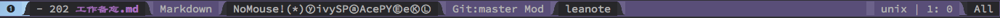

# leanote-mode
[](https://travis-ci.org/aborn/leanote-emacs)
[](https://elpa.popkit.org/#/leanote)  

A minor mode writing notes in emacs with elegant way [leanote](https://leanote.com/[leanote])
and its [open source platform](http://leanote.org/).

## Install
Install it from elpa source package (i.e. [melpa](https://melpa.org/) or [popkit elpa](https://elpa.popkit.org/)).  
```elisp
M-x package-install RET leanote RET
```
Manually install, download leanote.el file to folder */path/to/leanote/*  
```elisp
(add-to-list 'load-path "/path/to/leanote/")
(require 'leanote)
```

## Usage
After install, add following code to your init(.emacs or init.el anyway) file.
```elisp
(add-hook 'markdown-mode-hook 'leanote)
```
**Note:** Config your own server api if you use youself host(vps) as following  
```elisp
(setq leanote-api-root "https://your-domain/api")
```

## Actions
* M-x leanote-login ------ login to server.
* M-x leanote-sync ------- sync all notes from server to local.
* M-x leanote-push ------- push current note to remote server (include create new).
* M-x leanote-pull ------- pull and force update current note from server.
* M-x leanote-find find -- all notes in current account(default use swiper).
* M-x leanote-helm-find -- find all notes in current account(helm).
* M-x leanote-delete ----- delete current note.
* M-x leanote-rename ----- rename current note.

## Hotkey for action
* **C-x C-l u** leanote-push
* **C-x C-l r** leanote-rename
* **C-x C-l f** leanote-find
* **C-x C-l o** leanote-pull

## Leanote status
First of all, install spaceline (need 2.x version), install leanote status
```elisp
(leanote-spaceline-status)
```
The mode line show it status when markdown file is leanote, 

What's more, when leanote note is modified local (without push to remote), the mode line show **leanote***

Not login status

Already login status

Need sync with remote


## Leanote log
All logs are recorded in \*Leanote-Log* buffer.

English version readme ends here. Chinese readme provided as follows.

--------------------------------------------------------------------------------

# leanote-mode
leanote-mode是emacs下的一个**minor-mode**，使得你能在emacs下优雅的记笔记。同时，
可采用[leanote](https://leanote.com/)提供的服务保存markdown格式的笔记内容。

## 安装
从elpa的源中进行安装（如[melpa](https://melpa.org/) 或者 [popkit elpa](https://elpa.popkit.org/).）  
```elisp
M-x package-install RET leanote RET
```
手工安装，下载leanote.el文件到文件夹*/path/to/leanote/*
```elisp
(add-to-list 'load-path "/path/to/leanote/")
(require 'leanote)


## 使用
将下面代码添加到你emacs的启动文件(.emacs 或者 init.el 或者 .spacemacs)
```elisp
(add-hook 'markdown-mode-hook 'leanote)
```
如果你是自己部署leanote的服务，配置自己服务的api
```elisp
(setq leanote-api-root "https://your-domain/api")
```

## 常用功能
* M-x leanote-login ------ 登录服务器
* M-x leanote-sync ------- 同步所有远端笔记到本地
* M-x leanote-push ------- 将当前本地笔记上传到远端(如果远端没有就创建之)
* M-x leanote-pull ------- 强制同步当前笔记为远端内容
* M-x leanote-find find -- 查找当前账号下所有本地笔记(用swiper方式)
* M-x leanote-helm-find -- 查找当前账号下所有本地笔记(用helm方式)
* M-x leanote-delete ----- 删除当前笔记
* M-x leanote-rename ----- 重命名当前笔记

## 常功能绑定的快捷键
* **C-x C-l u** leanote-push
* **C-x C-l r** leanote-rename
* **C-x C-l f** leanote-find
* **C-x C-l o** leanote-pull

## leanote状态显示
当一个markdown文件为leanote时，其mode line会显示出来，如下：

当一个leanote文件只是在本地修改了，没有同步到远端的时，状态显示为**leanote***，如下：

没有登录时的状态

已经登录时的状态

本地笔记没有远程笔记新时，需要同步远程笔记时的状态


## 操作日志
所有的操作日志被记录在\*Leanote-Log* 这个buffer里。
